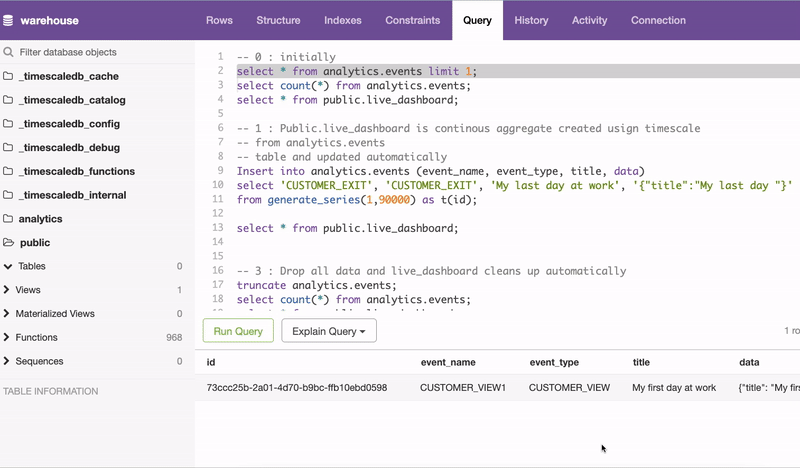

# Awesome-Postgres-Realtime-Materialized-Tables-Using-Timescale
Postgres Realtime Materialized Tables Using Timescale DB ( PostgreSQL ++ for time series and events )

This is a reference implementation of Timescale (Postgres Extension) realtime materialized tables 

1. It won't work with AWS Aurora Postgres or AWS RDS as they dont support Timescale extension yet, source https://docs.aws.amazon.com/AmazonRDS/latest/AuroraPostgreSQLReleaseNotes/AuroraPostgreSQL.Extensions.html#AuroraPostgreSQL.Extensions.16
2. Self hosted Postgres  should work, or you can use it SAAS service from Timescale https://www.timescale.com/blog/how-we-are-building-a-self-sustaining-open-source-business-in-the-cloud-era/

## Screenshots

